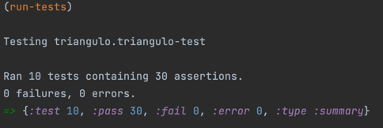
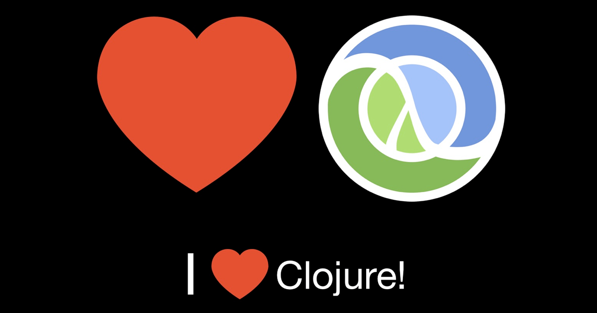

# 911 - Functional Devs (1) - ADA Let's Code

## Exercício que trabalha a geometria do triângulo

Aqui são apresentando usos de funções para resolver o seguinte:

Calcula o perímetro do triângulo, dado A B e C

Calcular radianos dado lados a b e c de um triângulo

Calcula o ângulo ∠A, dado A B C.

Calcula a área de um triângulo usando a fórmula de Heron

Verifica se o triângulo é equilateral

Verifica se pelo menos dois lados são iguais.

Verifica se os lados dos triângulos são diferentes entre si.

Verifica se é um triângulo retângulo, cujos ângulos são iguais a 90o.

Verifica se o triângulo é obtuso, tendo algum angulo >90o.

Verifica se o triângulo é obtuso, tendo algum angulo >90o

##  Tools

- [ ] [API for clojure.math - Clojure v1.11 (stable)](https://clojure.github.io/clojure/clojure.math-api.html)
- [ ] [keisan.casio.com)](https://keisan.casio.com/exec/system/1223267646)
- [ ] [calculator.net](https://www.calculator.net/triangle-calculator.html)

